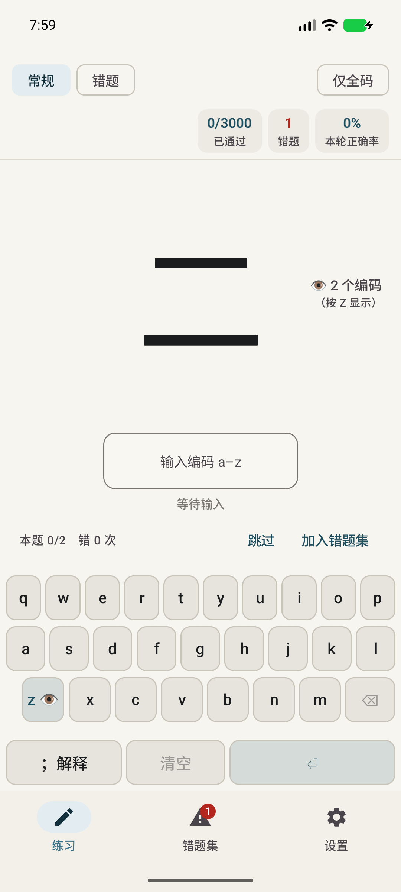
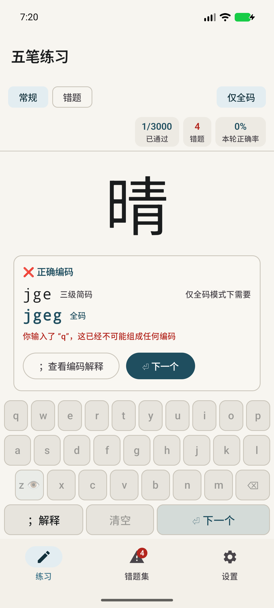
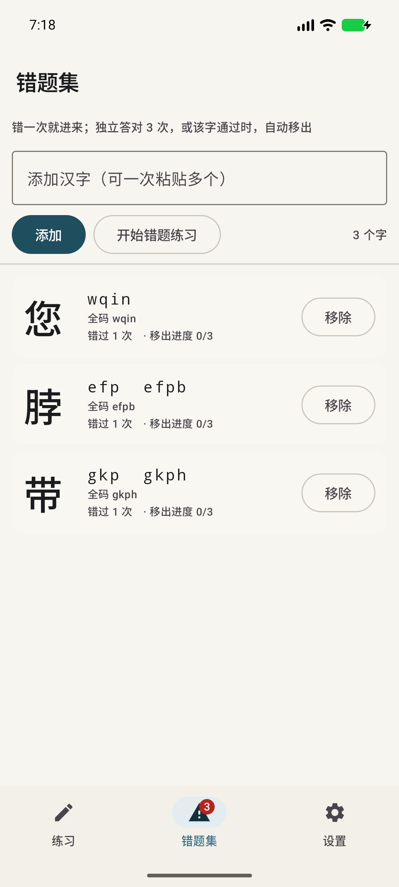
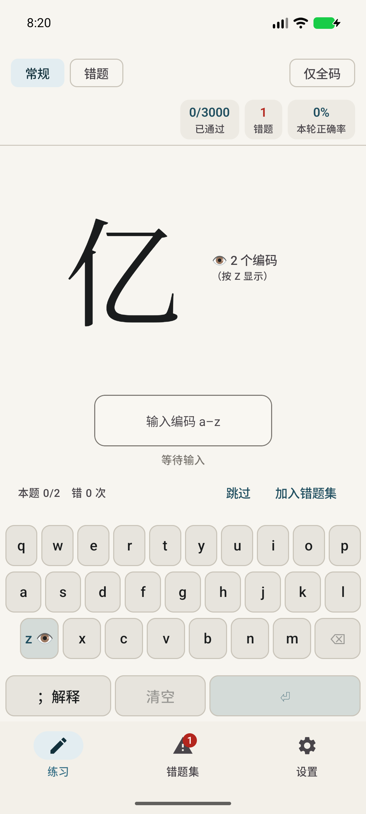
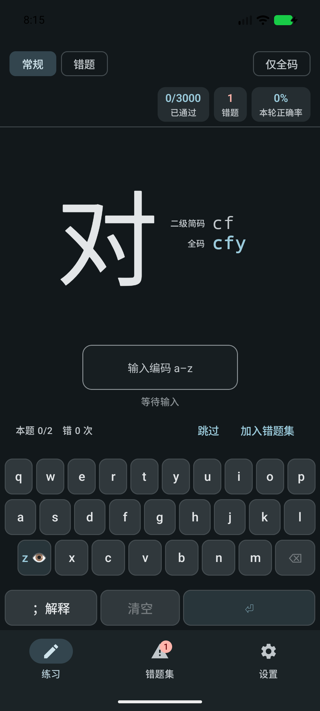
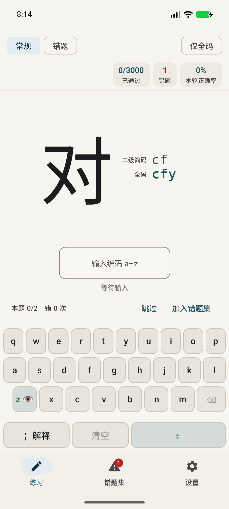

# 五笔练习 (WubiTrainer)

An offline Android drill app for **single-character Wubi86 (五笔字型) encoding**.
一款离线的 Android 单字五笔86（五笔字型）编码练习应用。

[中文](#中文) · [English](#english)

---

## 中文

显示一个汉字，你输入它的五笔编码，应用判断该答案是否让这个字*通过*。没有账号、没有网络、没有权限——进度保存在一个你可以自行查看、复制和备份的纯文本 TSV 文件里。

<p align="center">
  
  
</p>

### 功能

| | |
|---|---|
| **按字频抽样** | 汉字来自笪骏（Jun Da）的字频表，而非均匀抽取。默认字池是**现代汉语**字频表的前 **3000** 字——覆盖实际行文的 99.2 %。 |
| **隐藏答案** | 编码默认隐藏。按 **`z`**（或 👁 键）显示答案。 |
| **纠错，而不只是惩罚** | 答错会立即显示一张卡片，列出该字**所有**编码，每个都标注 一级简码 / 二级简码 / 三级简码 / 全码，并等待你确认。 |
| **以独立重复定通过** | 一个汉字在**多次独立呈现**中累计答对 **N 次**（默认 2 次）即算通过。在此之前任何一次答错都会把计数清零。一旦通过就保持通过，不再出现。 |
| **仅全码模式** | 可选严格模式：只有**最长**编码算对。此时 `工` 需要 `aaaa`，`a` / `aaa` 都算错。 |
| **错题集** | 每次答错都会进入错题集。答对 **K 次**（默认 3 次）后移出——或在汉字**通过**时立即移出。你也可以手工添加汉字，并有一种只练错题集的模式。 |
| **解释任意汉字** | 按 **`;`**——在输入时或在纠错卡片上——在浏览器中打开该字的 `search-wubi` 页面。 |
| **进度永不丢失** | `progress.tsv` 先写入临时文件、`fsync`，再原子重命名，并保留上一版本作为备份。 |
| **浅色与深色模式** | 二者兼具，跟随系统设置。正确/错误颜色随主题变化（纸上用深墨色，近黑底上用浅色调），并且每种语义色对其背景都满足 4.5:1 对比度——由单元测试校验，而非凭肉眼。 |

### 界面

三个页面，通过底部导航栏切换：

- **练习** —— 练习界面。顶部包含模式芯片（常规 / 错题 / 仅全码）和计数器；汉字及其隐藏或显示的编码；你的输入缓冲区，旁边是 **跳过**（不答题直接进入下一题——不记录任何内容）和 **加入错题集**（手工把它标记为难题——会记录它并停在原地）；然后是屏幕上的 QWERTY 键盘。
- **错题集** —— 你错过的每个汉字，连同其编码以及距离移出还有多近（该标签带有一个显示数量的角标）。粘贴汉字文本来添加汉字；逐个移除；从这里开始错题练习。
- **设置** —— 所有开关（见下）、进度文件路径、导出、重置，以及数据署名。

界面外壳全程使用 Material 3 —— `Scaffold`、`TopAppBar`、`NavigationBar`、`FilterChip`、`Card`、`Snackbar`、`OutlinedTextField`、`Switch` —— 并跟随系统的浅色/深色设置。屏幕键盘是唯一刻意非 Material 的控件，因为 Material 没有键盘按键；它由 `Surface` 构建，因此仍然像 Material 控件一样带有水波纹、裁剪和主题。

<p align="center">
  
  
  
</p>

显示答案时的状态（编码逐行堆叠在汉字右侧，每行都带有自己的 一级简码 / 二级简码 / 三级简码 / 全码 标注）：

<p align="center">
  
</p>

### 按键

| 按键 | 操作 |
|---|---|
| `a`–`y` | 输入五笔编码 |
| `z` | 显示 / 隐藏编码——*除非* 该字自身的编码包含 `z`（只有 6 个这样的字），此时 `z` 是普通输入 |
| `;` | 在浏览器中打开编码解释 |
| `Enter` | 在回车判定模式下提交，或确认纠错卡片 |
| `Backspace` | 删除一个字母 |
| `Esc` | 清空输入 |

屏幕键盘为手机提供同样的操作，因此练习过程中永远不会涉及系统键盘——也就不会涉及中文输入法。

### 设置

| 设置 | 默认值 | 选项 |
|---|---|---|
| 通过所需正确次数 N | 2 | 1–10 |
| 错题移出所需正确次数 K | 3 | 1–10 |
| 判定方式 | 即时判定 | 即时判定 (accept on the fly) / 回车判定 (accept on Enter) |
| 答案接受范围 | 任意编码 | 任意编码 / 排除一级简码 / 仅全码 |
| 不可能的输入立即判错 | on | on / off |
| 练习范围 | 前 3000 字 | 500 / 1000 / 2000 / 3000 / 5000 / 9933 / 全部 |
| 字频表 | 现代汉语 | 现代汉语 (9,933 字) / 网站默认表 (11,115 字) |
| 抽样权重 | 缓和 (freq^0.5) | 纯字频 (freq) / 缓和 / 均匀 |
| 屏幕键盘 / `z` 快捷键 / `;` 快捷键 | on | on / off |
| 键盘高度 | 标准 (46 dp) | 小 (38) / 标准 (46) / 大 (56) / 特大 (68) |
| 汉字字体 | 默认 | 默认 / 宋体 (系统字体链决定，设置页有实时示例) |

---

### 构建

Gradle 需要 JDK 17+；辅助脚本会自动使用 Android Studio 自带的 JDK。

```bash
cd /home/xudong/AndroidStudioProjects/WubiTrainer
./scripts/build.sh :app:assembleDebug          # → app/build/outputs/apk/debug/app-debug.apk
./scripts/build.sh :app:testDebugUnitTest      # 58 个单元测试
```

#### 发布构建

```bash
./scripts/build.sh :app:assembleRelease
# → app/build/outputs/apk/release/app-release.apk
```

发布签名使用项目根目录下的 `keystore.properties` + `wubitrainer-release.jks`。二者都被 **gitignore 忽略**，属性文件权限为 `chmod 600`。全新克隆依然可以构建——只是产出未签名的 APK，因为签名配置是以条件方式接入的。

请妥善保管这两个文件（并备份到本机之外的位置）：**一旦丢失密钥库，你将永远无法更新已安装的应用**，因为 Android 会拒绝使用不同密钥签名的更新。用下面的命令检查签名结果：

```bash
$JAVA_HOME/bin/java -version >/dev/null   # apksigner 需要 PATH 上有 java
$ANDROID_HOME/build-tools/36.0.0/apksigner verify --verbose app/build/outputs/apk/release/app-release.apk
```

AGP 9 只使用**启用的最高签名方案**，因此发布 APK 会报告 `v3: true` 而 `v1`/`v2: false`。这是预期行为：v3 自 Android 9 起就已存在，而 `minSdk` 是 30。

#### 安装

只连接了一台实体 Android 手机时想安装？请明确指定目标——debug 构建的包名是 `com.xudong.wubitrainer.debug`，而 release APK 安装为 `com.xudong.wubitrainer`：

```bash
adb install -r app/build/outputs/apk/debug/app-debug.apk
```

在 Android Studio 中打开项目按常规方式即可（`local.properties` 已指向 `/home/xudong/Android/Sdk`）。

#### 测试

```bash
./scripts/build.sh :app:testDebugUnitTest      # 58 个 JVM 单元测试
```

#### 从设备读取进度

```bash
adb shell run-as com.xudong.wubitrainer.debug cat files/progress.tsv
```

或使用 **设置 → 导出进度 TSV**，它会复制该文件并弹出分享面板。

### 数据从何而来

```
wubi86.dict.yaml  (rime-wubi, GPL-3.0)  ─┐
Jun Da frequency list, Modern (9,933)  ─┼─►  tools/build_assets.py  ─►  app/src/main/assets/
Jun Da frequency list, default (11,115)─┘                                  wubi_chars.tsv   (12,041 rows)
                                                                           wubi_full.tsv    (70,944 rows)
                                                                           ASSET_MANIFEST.txt
                                                                           ATTRIBUTION.txt
```

应用只打包生成的 TSV：它从不解析 YAML 或 HTML，也不发起任何网络请求。要从源码重建资产：

```bash
python3 tools/build_assets.py            # 首次运行时下载到 tools/sources/
python3 tools/build_assets.py --offline  # 复用已缓存的来源
```

`tools/build_assets.py` 会把 SHA-256 校验和与行数写入 `ASSET_MANIFEST.txt`，因此已发布的资产总能追溯到它的来源。清单与署名也见于 **设置 → 关于**。

关于这些数据、值得了解的事实，全部由测试套件验证：

- 70,944 个不同的单字带有五笔86编码。字典中 **61,220 个词条被丢弃**——本应用只训练单字。
- 4,445 个汉字有多个有效编码（简码加上全码）。430 个有**两个**不同的四字母编码（`齰` = `hbaj` / `hwwj`），二者都接受。
- 3,405 个汉字的**最长**编码只有三字母，因为它们分解出的字根少于四个（`了` = `bnh`，`有` = `def`）。对它们而言，全码就是三字母编码；要求四字母会让它们无法通过。
- `z` 出现在 662 个字典编码中，但字频池中只有 **6** 个汉字用到它：`匚 钅 肀 攵 尢 彡`。这正是 `z` 可以安全用作显示快捷键的原因。
- 字典中也包含标点与 Latin-1 符号，使用占位的 `zz…` 编码；错题集的添加框会拒绝任何非汉字。

### 项目结构

```
app/src/main/java/com/xudong/wubitrainer/
  AppController.kt            状态持有者：repository + progress + settings + engine
  MainActivity.kt             唯一的 Activity（锁定竖屏）
  data/  WubiCode.kt          CharEntry：按长度排序的编码、全码辅助方法
         WubiAssets.kt        纯 TSV 解析器与汉字解析顺序
         WubiRepository.kt    资产加载，在主线程之外
         Progress.kt          CharProgress + progress.tsv 编解码
         ProgressStore.kt     原子写入、备份、隔离、加载恢复
         Settings.kt          Settings + SharedPreferences
  engine/ PracticeEngine.kt   全部规则集，无任何 Android 依赖
  ui/    PracticeScreen.kt    练习、纠错卡片、键盘
         MistakeScreen.kt     错题集管理
         SettingsScreen.kt    设置、统计、导出、重置、关于
         Root.kt              导航与硬件按键路由
app/src/test/java/...         58 个 JVM 单元测试（engine、解析器、进度恢复）
docs/PRD.md                   完整的产品需求文档
docs/DEVELOPER.md             面向开发者的架构文档（英文）
tools/build_assets.py         资产流水线
tools/make_icon.py            启动图标生成器
```

引擎刻意不依赖 Android，因此每条通过/错误规则都由纯 JVM 测试验证。

### 许可与致谢

- 五笔86编码表：[`rime-wubi`](https://github.com/rime/rime-wubi) —— GPL-3.0。源码文件中署名的作者：Gong Chen、Yu Yuwei、Chen Xing，以及 Wozy（最初的极点五笔表）。
- 汉字字频表：笪骏（Jun Da）—— <https://lingua.mtsu.edu/chinese-computing/>。
- `;` 快捷键会在浏览器中打开 <https://hantang.github.io/search-wubi/>，该页面由你的浏览器按其自身条款获取。WubiTrainer 本身不发起任何网络请求。

---

## English

One Chinese character is shown, you type its Wubi code, and the app decides whether that answer
*passes* the character. No accounts, no network, no permissions — progress lives in one
plain-text TSV file you can read, copy and back up yourself.

<p align="center">
  
  
</p>

### What it does

| | | |
|---|---|---|
| **Sample by frequency** | Characters come from Jun Da's frequency lists, not uniformly. The default pool is the top **3000** characters of the Modern Chinese list — 99.2 % of running text. |
| **Hide the answer** | The encoding is hidden by default. Press **`z`** (or the 👁 key) to reveal it. |
| **Correct it, don't just punish it** | A wrong answer immediately shows a card with **every** encoding the character has, each labelled 一级简码 / 二级简码 / 三级简码 / 全码, and waits for you to acknowledge it. |
| **Pass by independent repetition** | A character passes after **N correct answers** (default 2) across separate presentations. Any mistake before then resets the count to zero. Once passed, it stays passed and stops appearing. |
| **仅全码 mode** | Optional strict mode: only the **longest** encoding counts. `工` then requires `aaaa`, and `a`/`aaa` are wrong. |
| **错题集 (mistake set)** | Every miss lands in the mistake set. It comes out again when you get it right **K times** (default 3) — or immediately when the character **passes**. You can also add characters by hand, and there is a mode that drills only the mistake set. |
| **Explain any character** | Press **`;`** — while typing or on the correction card — to open `search-wubi` for that character in your browser. |
| **Never lose progress** | `progress.tsv` is written to a temp file, `fsync`ed, and atomically renamed, with the previous version kept as a backup. |
| **Light and dark mode** | Both, following the system setting. The 正确/错误 colours are theme-aware (dark inks on paper, light tints on near-black) and every semantic colour clears a 4.5:1 contrast ratio against its background — checked by a unit test, not by eye. |

### Screens

Three destinations, switched by the bottom navigation bar:

- **练习** — the drill. A header holding the mode chips (常规 / 错题 / 仅全码) and the counters; the
  character with its hidden-or-revealed encoding; your input buffer with **跳过** (move on without
  answering — records nothing) and **加入错题集** (mark it a problem by hand — records it and stays
  put) beside the tally; then the on-screen QWERTY keypad.
- **错题集** — every character you have missed, with its encodings and how close it is to leaving
  (the tab carries a badge with the count). Add characters by pasting Han text; remove them one by
  one; start 错题练习 from here.
- **设置** — every knob (below), the progress file path, export, resets, and the data attribution.

The chrome is Material 3 throughout — `Scaffold`, `TopAppBar`, `NavigationBar`, `FilterChip`,
`Card`, `Snackbar`, `OutlinedTextField`, `Switch` — and follows the system light/dark setting. The
on-screen keypad is the one deliberately non-Material control, because there is no Material
keyboard key; it is built from `Surface` so it still ripples, clips and themes like one.

<p align="center">
  
  
  
</p>

The revealed state (encodings stacked one per line to the right of the character, each carrying its
own 一级简码 / 二级简码 / 三级简码 / 全码 label):

<p align="center">
  
</p>

### Keys

| Key | Action |
|---|---|
| `a`–`y` | Type the Wubi code |
| `z` | Reveal / hide the encoding — *unless* the character's own code contains `z` (only 6 do), in which case `z` is ordinary input |
| `;` | Open the encoding explanation in the browser |
| `Enter` | Submit (in 回车判定 mode), or acknowledge the correction card |
| `Backspace` | Delete one letter |
| `Esc` | Clear the input |

The on-screen keypad covers the same actions for phones, so no system keyboard — and therefore no
Chinese IME — is ever involved in the drill.

### Settings

| Setting | Default | Options |
|---|---|---|
| 通过所需正确次数 N | 2 | 1–10 |
| 错题移出所需正确次数 K | 3 | 1–10 |
| 判定方式 | 即时判定 | 即时判定 (accept on the fly) / 回车判定 (accept on Enter) |
| 答案接受范围 | 任意编码 | 任意编码 / 排除一级简码 / 仅全码 |
| 不可能的输入立即判错 | on | on / off |
| 练习范围 | 前 3000 字 | 500 / 1000 / 2000 / 3000 / 5000 / 9933 / 全部 |
| 字频表 | 现代汉语 | 现代汉语 (9,933 字) / 网站默认表 (11,115 字) |
| 抽样权重 | 缓和 (freq^0.5) | 纯字频 (freq) / 缓和 / 均匀 |
| 屏幕键盘 / `z` 快捷键 / `;` 快捷键 | on | on / off |
| 键盘高度 | 标准 (46 dp) | 小 (38) / 标准 (46) / 大 (56) / 特大 (68) |
| 汉字字体 | 默认 | 默认 / 宋体 (系统字体链决定，设置页有实时示例) |

---

### Building

Gradle needs a JDK 17+; Android Studio's bundled one is used automatically by the helper script.

```bash
cd /home/xudong/AndroidStudioProjects/WubiTrainer
./scripts/build.sh :app:assembleDebug          # → app/build/outputs/apk/debug/app-debug.apk
./scripts/build.sh :app:testDebugUnitTest      # 58 unit tests
```

#### Release build

```bash
./scripts/build.sh :app:assembleRelease
# → app/build/outputs/apk/release/app-release.apk
```

Release signing uses `keystore.properties` + `wubitrainer-release.jks` at the project root. Both are
**gitignored** and the properties file is `chmod 600`. A fresh clone still builds — it just produces
an unsigned APK, because the signing config is wired in conditionally.

Keep both files safe (and back them up somewhere other than this machine): **if you lose the
keystore you can never update an installed copy of the app**, because Android refuses an update
signed with a different key. Check the signed result with:

```bash
$JAVA_HOME/bin/java -version >/dev/null   # apksigner needs java on PATH
$ANDROID_HOME/build-tools/36.0.0/apksigner verify --verbose app/build/outputs/apk/release/app-release.apk
```

AGP 9 signs with the **highest enabled scheme only**, so the release APK reports `v3: true` and
`v1`/`v2: false`. That is expected: v3 has existed since Android 9 and `minSdk` is 30.

#### Installing

Installing on a device with only a physical Android phone attached? Target it explicitly — the
package id in debug builds is `com.xudong.wubitrainer.debug`, while the release APK installs as
`com.xudong.wubitrainer`:

```bash
adb install -r app/build/outputs/apk/debug/app-debug.apk
```

Opening the project in Android Studio works as usual (`local.properties` already points at
`/home/xudong/Android/Sdk`).

#### Testing

```bash
./scripts/build.sh :app:testDebugUnitTest      # 58 unit tests
```

#### Reading your progress off the device

```bash
adb shell run-as com.xudong.wubitrainer.debug cat files/progress.tsv
```

or use **设置 → 导出进度 TSV**, which copies the file and offers a share sheet.

### Where the data comes from

```
wubi86.dict.yaml  (rime-wubi, GPL-3.0)  ─┐
Jun Da frequency list, Modern (9,933)  ─┼─►  tools/build_assets.py  ─►  app/src/main/assets/
Jun Da frequency list, default (11,115)─┘                                  wubi_chars.tsv   (12,041 rows)
                                                                           wubi_full.tsv    (70,944 rows)
                                                                           ASSET_MANIFEST.txt
                                                                           ATTRIBUTION.txt
```

The app ships only the generated TSVs: it never parses YAML or HTML, and it makes no network
requests. To rebuild the assets from source:

```bash
python3 tools/build_assets.py            # downloads into tools/sources/ on first run
python3 tools/build_assets.py --offline  # reuse whatever is already cached
```

`tools/build_assets.py` writes SHA-256 sums and row counts into `ASSET_MANIFEST.txt`, so a shipped
asset can always be traced back to its inputs. The manifest and attribution are also visible in
**设置 → 关于**.

Facts worth knowing about that data, all verified by the test suite:

- 70,944 distinct single characters carry a Wubi86 code. The dictionary's **61,220 word entries are
  discarded** — this app trains characters only.
- 4,445 characters have several valid codes (short codes plus the full code). 430 have **two**
  distinct four-letter codes (`齰` = `hbaj` / `hwwj`) and both are accepted.
- 3,405 characters have a **three-letter** longest code, because they decompose into fewer than
  four radicals (`了` = `bnh`, `有` = `def`). For those, 全码 means the three-letter code; requiring
  four would make them unpassable.
- `z` appears in 662 dictionary codes, but only **6** characters in the frequency pool use it:
  `匚 钅 肀 攵 尢 彡`. That is what makes `z` safe as the reveal shortcut.
- The dictionary also carries punctuation and Latin-1 symbols with placeholder `zz…` codes; the
  错题集 add box refuses anything that is not a Han character.

### Project layout

```
app/src/main/java/com/xudong/wubitrainer/
  AppController.kt            state holder: repository + progress + settings + engine
  MainActivity.kt             the only activity (portrait-locked)
  data/  WubiCode.kt          CharEntry: codes sorted by length, full-code helpers
         WubiAssets.kt        pure TSV parsers and the character resolution order
         WubiRepository.kt    asset loading, off the main thread
         Progress.kt          CharProgress + the progress.tsv codec
         ProgressStore.kt     atomic writes, backup, quarantine, load recovery
         Settings.kt          Settings + SharedPreferences
  engine/ PracticeEngine.kt   the whole rule set, with no Android dependency
  ui/    PracticeScreen.kt    drill, correction card, keypad
         MistakeScreen.kt     错题集 management
         SettingsScreen.kt    settings, stats, export, resets, about
         Root.kt              navigation and hardware-key routing
app/src/test/java/...         58 JVM unit tests (engine, parsers, progress recovery)
docs/PRD.md                   the full product requirements document
docs/DEVELOPER.md             the developer / architecture guide
tools/build_assets.py         the asset pipeline
tools/make_icon.py            the launcher-icon generator
```

The engine deliberately has no Android dependency, so every pass/mistake rule is verified by plain
JVM tests.

### Licence and credits

- Wubi86 encoding table: [`rime-wubi`](https://github.com/rime/rime-wubi) — GPL-3.0. Authors credited
  in the source file: Gong Chen, Yu Yuwei, Chen Xing, and Wozy (original JidianWubi table).
- Character frequency lists: Jun Da (笪骏) — <https://lingua.mtsu.edu/chinese-computing/>.
- The `;` shortcut opens <https://hantang.github.io/search-wubi/>, which is fetched by your browser
  under its own terms. WubiTrainer itself makes no network requests.
